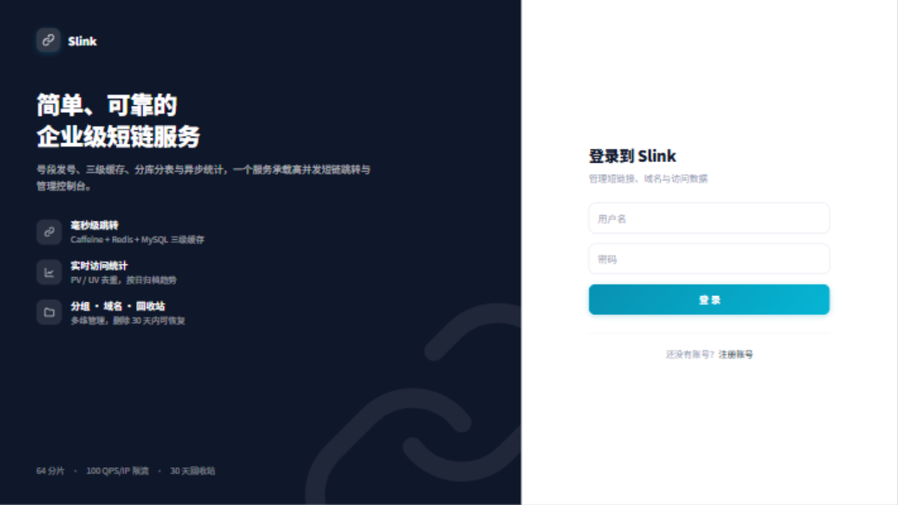
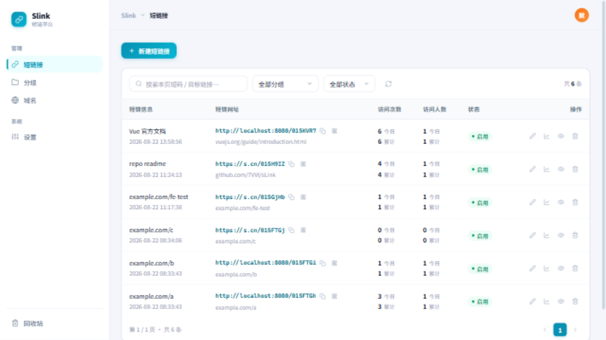
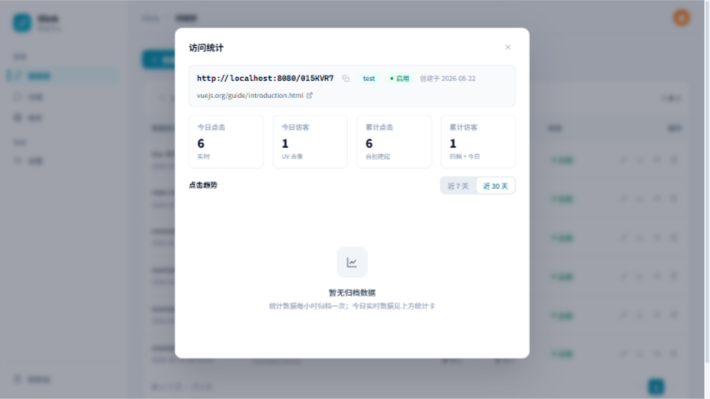

# Slink · Java 高性能短链系统

基于 **Spring Boot 3 + WebFlux + JDK 21** 的短链系统：单服务同时提供高并发短链跳转与 Vue 3 管理控制台。
核心能力：**Leaf 号段发号器、Caffeine + Redis + MySQL 三级缓存、Disruptor 异步统计、ShardingSphere 分库分表、Sa-Token 登录鉴权**，并内置分组、回收站、域名管理与实时 PV/UV 统计。

## 界面预览

| 登录 | 短链管理 |
| :---: | :---: |
|  |  |

| 访问统计（列表内弹窗） |
| :---: |
|  |

## 核心特性

- **毫秒级跳转**：三级缓存 + 布隆过滤器防穿透，上下线/编辑秒级生效
- **轻量统计**：Disruptor 攒批 + Redis Pipeline，实时今日/累计 PV、UV 去重，按日归档趋势图
- **管理能力**：分组、域名管理、回收站（30 天可恢复）、批量创建、二维码、访问统计弹窗
- **高可用底座**：号段发号器双 Buffer、4 库 × 16 表共 64 分片、按 IP 令牌桶限流
- **单服务交付**：前端构建产物内嵌进可执行 jar，一个进程即完整前后端

## 快速开始

### 1. 启动基础设施

```bash
cd deploy
docker compose up -d          # MySQL(3306) + Redis(6379)，首次启动自动建库建表
```

### 2. 构建与启动（JDK 21+）

```bash
mvn clean package -DskipTests
java -jar short-link-server/target/short-link-server-1.0.0-SNAPSHOT.jar
```

### 3. 访问

| 入口 | 地址 |
| ---- | ---- |
| 管理控制台（前端） | <http://localhost:8080> |
| 短码跳转 | <http://localhost:8080/{code}> 302 到目标链接 |
| Swagger 文档 | <http://localhost:8080/swagger-ui.html> |
| 健康检查 | <http://localhost:8080/actuator/health> |

默认管理员 `admin / admin123`（仅用户表为空时创建，登录后请立即修改）。

> 连接密码在 `short-link-server/src/main/resources/sharding.yaml`（数据库）与
> `application.yml`（Redis）中修改。全新部署首次启动会以
> `http://localhost:8080` 作为引导默认域名，请在「域名管理」中替换为正式域名。

### 前端开发模式（可选）

前后端分离联调时无需重新打包，前端以 Vite 开发服务器启动，`/api` 自动代理到 8080：

```bash
cd short-link-web
npm install
npm run dev                  # http://localhost:5173，改动热更新
```

> 根构建由 frontend-maven-plugin 自动下载 Node（装至 `short-link-web/target/`，
> 不污染全局）；已装 Node 20+ 时上述命令开箱即用。

## 模块结构

```
shortLink
├── short-link-common     通用层：Base62、URL 校验、Redis Key 规划、错误码、Result、DTO
├── short-link-core       核心层：发号器、三级缓存、布隆过滤器、Disruptor 统计、领域服务、DAL
├── short-link-web        前端：Vue 3 + Vite 控制台（构建产物内嵌进 server jar）
├── short-link-server     接入层：WebFlux 控制器、Sa-Token 鉴权、限流、OpenAPI 文档（可执行 jar）
├── deploy
│   ├── docker-compose.yml   一键启动 MySQL 8 + Redis 7
│   └── sql/01-init.sql      建库建表脚本（主库 + 4 分片库 × 16 表 = 64 分片）
├── API.md                  接口文档（全部 REST API、错误码、功能说明）
└── ARCHITECTURE.md         核心设计（缓存/发号/分片/统计/鉴权）
```

## 更多文档

- **[API.md](./API.md)** —— 全部接口、鉴权约定、错误码与功能说明
- **[ARCHITECTURE.md](./ARCHITECTURE.md)** —— 发号器、三级缓存、分片、异步统计、安全设计
- **docs/design.md** —— 原始设计文档（含演进路线）

## 测试与日志

```bash
mvn test      # Base62 编解码往返、URL 合法性/黑名单、发号器单调/并发/跨号段
```

日志经 logback 配置：控制台彩色输出；`logs/short-link-server.log` 按天 + 100MB 滚动
（gzip、保留 30 天 / 2GB）；独立 ERROR 文件；异步写入不阻塞跳转热路径；
目录可用环境变量 `LOG_HOME` 覆盖，详见 `logback-spring.xml`。
